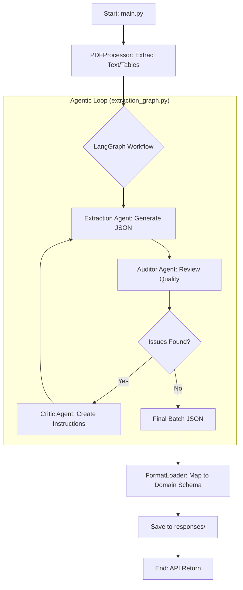

# PDF Claims Extraction API — Architecture

This document describes the application architecture, components, data flow, and how to extend the system.

---

## 1. Overview

The application is a **FastAPI** service that extracts structured insurance claims data from multi-page PDFs (e.g. VSP, EyeMed remittance documents). It uses:

- **LangGraph** as the **multi-agent orchestration framework**: explicit state graph with nodes (Extraction, Auditor, Critic) and conditional edges for the feedback loop (re-extract until no issues or max loops). This gives clear state transitions, debuggability, and production-grade orchestration.
- **Azure Document Intelligence** for table-aware text extraction (structure preserved).
- **Multi-agent pipeline**: Extraction Agent (Gemini or Claude) → Auditor → Critic → re-extraction until quality is acceptable, all orchestrated by LangGraph.
- **Dynamic output formats**: Pydantic schemas and mapping logic live in `formats/`; adding a new document type requires only a new Python module, no core code changes.

Supported use cases: ~100-page PDFs with complex tables; output is validated JSON matching a format-defined Pydantic schema.

---

## 2. Visual Architecture

### 2.1 3D Conceptual Model


### 2.2 Detailed Execution Flow (LangGraph)


## 3. High-Level Architecture

```
┌─────────────────────────────────────────────────────────────────────────────┐
│                              CLIENT (HTTP)                                   │
│  POST /api/v1/process-pdf  │  GET /health  │  GET /api/v1/responses  │ ...  │
└─────────────────────────────────────┬───────────────────────────────────────┘
                                      │
                                      ▼
┌─────────────────────────────────────────────────────────────────────────────┐
│                         FastAPI Application (main.py)                        │
│  • Validates file + document_type  • Loads format from formats/<type>.py     │
│  • Orchestrates pipeline per batch • Saves progressive responses to disk     │
└─────────────────────────────────────┬───────────────────────────────────────┘
                                      │
          ┌──────────────────────────┼──────────────────────────┐
          ▼                          ▼                          ▼
┌──────────────────┐    ┌─────────────────────┐    ┌─────────────────────────┐
│  PDFProcessor    │    │  Agent Factory      │    │  FormatLoader           │
│  (pdf_processor)  │    │  (agents/)          │    │  (format_loader)         │
│                  │    │                     │    │                          │
│ • Azure DI       │    │ • get_extraction_   │    │ • load_format(path)      │
│   (tables)       │    │   agent()           │    │ • BatchModel, Response  │
│ • PyMuPDF        │    │ • get_auditor_      │    │ • map_extracted_data    │
│   fallback       │    │   agent()           │    │ • SCHEMA_DESCRIPTION    │
│ • Page images    │    │ • get_critic_       │    │ • create_response()     │
└────────┬─────────┘    │   agent()           │    └─────────────────────────┘
         │              └──────────┬──────────┘
         │                          │
         │              ┌───────────┴───────────┐
         │              ▼                       ▼
         │    ┌─────────────────────────────────────────────────────────┐
         │    │  LangGraph workflow (extraction_graph.py)                │
         │    │  • StateGraph(ExtractionGraphState)                      │
         │    │  • Nodes: extraction → auditor → critic → extraction     │
         │    │  • Conditional edge: auditor → end | critic (if issues)  │
         │    └─────────────────────────────────────────────────────────┘
         │
         └──────────────────────────────────────────────────────────────────────▶
                    Batch text (Azure DI or PyMuPDF) + optional images
                    fed into LangGraph; graph invokes Extraction / Auditor / Critic agents
```

---

## 3. Directory and File Layout

```
project_root/
├── main.py                  # FastAPI app, /process-pdf orchestration
├── config.py                # Env-based config; EXTRACTION_AGENT, API keys, paths
├── format_loader.py         # Loads formats/*.py; returns BatchModel, schemas, map_extracted_data
├── pdf_processor.py         # PDF text (Azure DI + PyMuPDF), images, table structure
├── models.py                # Optional/legacy models (if present)
├── requirements.txt         # Dependencies (langgraph, langchain-core, anthropic, azure-ai-formrecognizer)
├── .env.example             # Template for .env
├── ARCHITECTURE.md          # This file
├── README.md                # Short intro and link to ARCHITECTURE
│
├── formats/                 # One module per document type (no hardcoding in core)
│   ├── vsp.py               # VSP remittance: Pydantic models, SCHEMA_DESCRIPTION, map_extracted_data
│   └── eyemed.py            # EyeMed remittance: same contract
│
├── agents/
│   ├── __init__.py
│   ├── extraction_graph.py       # LangGraph StateGraph: Extraction → Auditor → Critic (conditional loop)
│   ├── base_extraction_agent.py  # Abstract interface: extract_batch(..., improvement_instructions)
│   ├── gemini_agent.py            # Gemini implementation + learning memory, pydantic_validator_critic
│   ├── claude_extraction_agent.py # Claude (Anthropic) implementation
│   ├── auditor_agent.py          # Compares extracted JSON vs source; returns issues + lessons
│   ├── critic_agent.py           # Turns issues into improvement instructions
│   └── agent_factory.py          # get_extraction_agent(), get_auditor_agent(), get_critic_agent()
│
├── uploads/                 # Temporary uploaded PDFs (cleaned after process)
└── responses/               # Saved JSON responses (progressive + final)
```

---

## 4. Configuration (config.py and .env)

| Variable | Purpose |
|----------|---------|
| `EXTRACTION_AGENT` | `"gemini"` or `"claude"` — which LLM runs extraction (and Auditor/Critic). |
| `GEMINI_API_KEY`, `GEMINI_MODEL` | Used when `EXTRACTION_AGENT=gemini`. |
| `ANTHROPIC_API_KEY`, `CLAUDE_MODEL` | Used when `EXTRACTION_AGENT=claude`. |
| `AZURE_DI_KEY`, `AZURE_DI_ENDPOINT` | Azure Document Intelligence for table-aware text; optional. |
| `MAX_PAGES_PER_BATCH` | Pages per batch (e.g. 5). |
| `MAX_AUDITOR_CRITIC_LOOPS` | Max Extraction → Auditor → Critic re-extraction cycles per batch (e.g. 4). |
| `UPLOAD_DIR`, `RESPONSE_DIR`, `FORMATS_DIR` | Directories; formats are discovered from `FORMATS_DIR` (`formats/`). |

Supported document types are **discovered** from `formats/*.py` (any `.py` except `_*`); no list is hardcoded in the core.

---

## 5. The Life of a Request (End-to-End Flow)

When you hit the `/process-pdf` endpoint, the system triggers a sophisticated multi-stage pipeline designed for 100% data integrity.

### 5.1 Stage 1: Ingestion & Intelligence Alignment
1. **API Gateway**: `main.py` receives the PDF and `document_type`.
2. **Format Synthesis**: The `FormatLoader` dynamically injects the Pydantic rules for that specific provider (e.g., VSP).
3. **Chunking Engine**: If the PDF is massive (50+ pages), the system split and processes it in parallel-friendly chunks to ensure the AI's "attention span" remains sharp.

### 5.2 Stage 2: Multimodal Extraction
1. **Structural OCR**: Azure Document Intelligence extracts tables with precise grid alignment (`[TABLE]...[/TABLE]`).
2. **Visual Snapshots**: The system takes high-DPI snapshots of each page so the AI can "see" headers and formatting, not just read text.
3. **Contextual Stitching**: If a claim started on the previous page, the system passes "Continuation Context" to the agent so it can seamlessly finish the data block.

### 5.3 Stage 3: The Agentic Loop (Self-Healing)
1. **Extraction**: The Gemini-powered agent generates the first draft of the JSON.
2. **Audit**: A separate Auditor agent cross-references the JSON against the source PDF.
3. **Criticism**: If a single value is missing or formatted wrong, the Critic agent writes a "Refinement Plan."
4. **Correction**: The Extractor tries again, using the Critic's notes. This loop repeats up to 4 times until the data is perfect.

### 5.4 Stage 4: Synthesis & Delivery
1. **Consolidation**: All batches are merged into a unified document structure.
2. **Persistence**: The final JSON is saved to `responses/` and returned to the client.

---

## 6. System "Superpowers" (Advanced Features)

Beyond simple extraction, this system possesses several "Imaginative" advanced capabilities:

### 🛡️ Data Immune System (Auto-Correction)
Just like a biological immune system, the **Auditor-Critic loop** acts as a defensive layer. If the primary extractor makes a hallucination or skips a field, the system detects and "repairs" itself before the user ever sees the data.

### 🧠 Elastic Long-Term Memory
Through the `GlobalLearningMemory`, the system "learns" from failures. If the Auditor finds that a specific provider always hides the "Check Date" in a footer, the agent remembers that lesson for every subsequent page in the document.

### 🧵 Hierarchical Stitching
The system treats multi-page PDFs as a single continuous thread. It uses "Entity Context Passing" to ensure that a patient's name on Page 1 is correctly linked to their procedure codes on Page 4, even if they are separated by 20 other claims.

---

## 7. Components in Detail

### 6.1 PDFProcessor (pdf_processor.py)

- **Responsibilities**  
  - Open PDF (PyMuPDF), report page count.  
  - **Azure Document Intelligence**: `extract_with_azure_di(api_key, endpoint)` runs prebuilt-layout once per document and caches result; builds `tables_by_page`, `paragraphs_by_page`.  
  - **Structured text for a page range**: `get_structured_text_for_pages(page_numbers, api_key, endpoint)` returns a list of `{ page_number, text, char_count, source }`.  
    - If Azure DI is configured and successful, text is built from paragraphs + tables (tables as `[TABLE]...[/TABLE]`).  
    - Otherwise falls back to PyMuPDF `extract_text_for_pages()`.  
  - **Images**: `extract_images_from_pages(dpi, specific_pages)` → base64 PNGs for the LLM.  
- **No business logic** about claims or formats; only document-level extraction.

### 6.2 FormatLoader (format_loader.py)

- **Load**  
  - `load_format(format_path)` loads a Python module from `formats/`, discovers:  
    - `ClaimModel`, `ResponseModel`, `BatchModel`  
    - `SCHEMA_DESCRIPTION`  
    - `batch_json_schema`, `response_json_schema` (from Pydantic `model_json_schema()`)  
    - `map_extracted_data`, `section_builder`, `calculate_totals`  
- **Response building**  
  - `create_response(format_components, full_data, document_type)` validates `full_data` with `ResponseModel` and returns `model_dump()`.  
- **Contract for a format module**  
  - Export at least: `BatchModel` (e.g. `claims` + `metadata`), `ResponseModel`, `map_extracted_data(extracted_claims, aggregated_metadata)`, `SCHEMA_DESCRIPTION`.  
  - Optionally: `ClaimModel`, `section_builder`, `calculate_totals`.

### 6.3 Extraction Agent (agents/)

- **Interface** (`base_extraction_agent.py`):  
  - `extract_batch(..., improvement_instructions=None, previous_batch_text=None, previous_batch_json=None)` → dict compatible with BatchModel.  
  - **Memory/context**: `previous_batch_text` and `previous_batch_json` from the immediately prior batch are passed in so the agent can keep field names, structure, and formatting consistent and avoid contradicting or duplicating data.  
  - `reset_memory()`, `get_learning_context()` (optional).  
- **Implementations**  
  - **Gemini** (`gemini_agent.py`): MultiModelAgent, with **learning memory** (lessons, failed_fields, active_state like current_doctor) and optional `pydantic_validator_critic`. Prompt includes a “PREVIOUS BATCH CONTEXT” block when `previous_batch_text` / `previous_batch_json` are set (previous batch text truncated to last 12k chars if needed).  
  - **Claude** (`claude_extraction_agent.py`): same contract; prompt includes previous-batch context block when provided.  
- **Factory** (`agent_factory.py`): reads `config.EXTRACTION_AGENT` and returns the correct agent (and matching Auditor/Critic).

### 6.4 Auditor Agent (auditor_agent.py)

- **Input**: Extracted JSON, source text, schema description, document type, `is_last_batch`, optional images.  
- **Output**: `{ "issues": [ "issue with evidence", ... ], "lessons": [ "lesson", ... ] }`.  
- Uses the same provider (Gemini or Claude) as the Extraction Agent.  
- Lessons can be fed into the Extraction Agent’s learning context (e.g. Gemini’s `learning_memory.add_lesson`).

### 6.5 Critic Agent (critic_agent.py)

- **Input**: List of issues from the Auditor, optional schema description.  
- **Output**: A single string of improvement instructions for the Extraction Agent.  
- Used as `improvement_instructions` in the next `extract_batch()` call.

### 6.6 The Agent Squad (Detailed Breakdown)

Each agent in the `agents/` directory has a specific, critical role in the extraction pipeline:

| File | Agent Role | Core Responsibility |
|------|------------|---------------------|
| `extraction_graph.py` | **The Orchestrator** | Uses **LangGraph** to manage the lifecycle of a batch. It routes data between the Extractor, Auditor, and Critic in a cyclic feedback loop. |
| `gemini_agent.py` | **The Extractor** | The "Muscle". Performs multimodal extraction using Gemini 1.5 Pro. It handles complex table parsing, merges continuation data across pages, and uses "Learning Memory" to self-improve. |
| `auditor_agent.py` | **The Inspector** | The "Quality Control". It acts as a fresh set of eyes, comparing the Extractor's output against the raw PDF to find errors or missing data. |
| `critic_agent.py` | **The Strategist** | The "Coach". It takes the raw issues from the Auditor and converts them into precise, numbered "Improvement Instructions" for the Extractor to follow in the next retry. |
| `agent_factory.py` | **The HR Manager** | Decouples agent usage from implementation. It reads the system configuration and hires (instantiates) the right model provider (Gemini or Claude) for each role. |
| `format_generator_agent.py`| **The Onboarder** | Analyzes a brand-new PDF type and automatically generates the Pydantic format code required to support it in the future. |

---

### 6.7 LangGraph Workflow (extraction_graph.py)

The **multi-agent orchestration** uses **LangGraph** (stateful, cyclic graph) for best accuracy and clear control flow:

- **State** (`ExtractionGraphState`): `batch_text`, schema fields, `document_type`, `is_last_batch`, `image_b64_list`, `is_continuation`, `previous_context`, **`previous_batch_text`**, **`previous_batch_json`** (memory/context from the immediately prior batch for data consistency), `extracted_json`, `issues`, `lessons`, `improvement_instructions`, `loop_count`, `max_loops`.
- **Nodes**:
  - **extraction**: Calls `extraction_agent.extract_batch(...)` with state; writes `extracted_json` and increments `loop_count`.
  - **auditor**: Calls `auditor_agent.audit(...)`; writes `issues` and `lessons`; pushes lessons to extraction agent’s learning memory when present.
  - **critic**: Calls `critic_agent.get_improvement_instructions(issues)`; writes `improvement_instructions`.
- **Edges**:
  - `START` → **extraction** → **auditor**.
  - **auditor** → **conditional**: if `issues` non-empty and `loop_count < max_loops` → **critic**, else `END`.
  - **critic** → **extraction** (cycle).
- **Build**: `build_extraction_graph(extraction_agent, auditor_agent, critic_agent)` returns a compiled graph.
- **Run**: `run_extraction_workflow(compiled_graph, batch_text=..., max_loops=..., ...)` invokes the graph and returns the final `extracted_json`.

Using LangGraph gives explicit state transitions, conditional branching, and a single place to extend or inspect the Extraction → Auditor → Critic loop.

---

## 7. Data Flow (Per Batch)

```
Batch pages
    │
    ▼
get_structured_text_for_pages()  ──►  batch_text (with [TABLE] blocks if Azure DI)
extract_images_from_pages()      ──►  image_b64_list
    │
    ▼
┌─────────────────────────────────────────────────────────────────┐
│  LangGraph.invoke(initial_state)                                │
│    extraction → auditor → [if issues & loop<max] critic → extraction
│    Returns final state; result = state["extracted_json"]         │
└─────────────────────────────────────────────────────────────────┘
    │
    ▼
Pydantic validate (BatchModel) if available
    │
    ▼
Merge batch claims + metadata into global lists
Set previous_context from incomplete_entity_context if needed
Save progressive response (map_extracted_data → create_response → file)
```

---

## 8. Adding a New Document Format

1. Add `formats/<newtype>.py`.  
2. Define Pydantic models (e.g. claim/line item, batch, response).  
3. Export:  
   - `BatchModel` (e.g. `claims: List[...]`, `metadata: Optional[dict]`).  
   - `ResponseModel` (top-level API response).  
   - `map_extracted_data(extracted_claims, aggregated_metadata)` → dict for `ResponseModel`.  
   - `SCHEMA_DESCRIPTION` (string for LLM prompts).  
4. Optionally: `ClaimModel`, `section_builder`, `calculate_totals`.  
5. No changes in `main.py`, `config.py`, or agents: `document_type=<newtype>` and the format is discovered from `formats/<newtype>.py`.

---

## 9. API Endpoints

| Method | Path | Description |
|--------|------|-------------|
| GET | `/` | Service name and list of endpoints. |
| GET | `/health` | Status, `extraction_agent`, API configured flags, `supported_formats`. |
| POST | `/api/v1/process-pdf` | Body: `file` (PDF), `document_type` (e.g. vsp, eyemed). Returns structured JSON + metadata. |
| GET | `/api/v1/responses` | List saved response files. |
| GET | `/api/v1/response/{filename}` | Content of one response file. |

---

---

## 10. Techie Guide: Important File Locations & Workflows

To help you navigate and explain the system to other developers, here is a categorized map of the most important code locations:

### 🛠️ Core Infrastructure & API
- **Entry Point**: [main.py](file:///d:/8%20-%20EOB%20agentic%20solution/Backups/050225%20-%20full%20working%20backup/main.py)  
  *What it does*: Handles FastAPI routes, orchestrates the entire PDF processing loop, and manages batching.
- **Project Configuration**: [config.py](file:///d:/8%20-%20EOB%20agentic%20solution/Backups/050225%20-%20full%20working%20backup/config.py)  
  *What it does*: Manages API keys, model selections (Gemini vs. Claude), and global settings like batch sizes and loop limits.
- **DB Operations**: [db.py](file:///d:/8%20-%20EOB%20agentic%20solution/Backups/050225%20-%20full%20working%20backup/db.py)  
  *What it does*: Handles MySQL connection and operations for storing extracted data and format schemas.

### 🧠 The "Brain" (Agents & Orchestration)
- **LangGraph Workflow**: [agents/extraction_graph.py](file:///d:/8%20-%20EOB%20agentic%20solution/Backups/050225%20-%20full%20working%20backup/agents/extraction_graph.py)  
  *What it does*: The StateGraph that connects the Extractor, Auditor, and Critic. This is where the "Agentic loop" logic lives.
- **The Extractor Agent**: [agents/gemini_agent.py](file:///d:/8%20-%20EOB%20agentic%20solution/Backups/050225%20-%20full%20working%20backup/agents/gemini_agent.py)  
  *What it does*: Primary logic for prompt engineering and heavy-lifting data extraction using Google's Gemini models.
- **The Auditor Agent**: [agents/auditor_agent.py](file:///d:/8%20-%20EOB%20agentic%20solution/Backups/050225%20-%20full%20working%20backup/agents/auditor_agent.py)  
  *What it does*: Reviews extracted JSON against source text to identify missing or incorrect data.
- **Agent Factory**: [agents/agent_factory.py](file:///d:/8%20-%20EOB%20agentic%20solution/Backups/050225%20-%20full%20working%20backup/agents/agent_factory.py)  
  *What it does*: Decouples agent creation from usage; decides which agent implementation to load based on config.

### 📄 Document Intelligence & Formats
- **PDF Engine**: [pdf_processor.py](file:///d:/8%20-%20EOB%20agentic%20solution/Backups/050225%20-%20full%20working%20backup/pdf_processor.py)  
  *What it does*: Integrates with **Azure Document Intelligence** for structural extraction (tables/layout) and provides fallbacks.
- **Format Registry**: [formats/](file:///d:/8%20-%20EOB%20agentic%20solution/Backups/050225%20-%20full%20working%20backup/formats/)  
  *What it does*: Contains one file per insurance provider (e.g., `vsp.py`, `eyemed.py`). These files define the Pydantic schemas and mapping logic.
- **Dynamic Loader**: [format_loader.py](file:///d:/8%20-%20EOB%20agentic%20solution/Backups/050225%20-%20full%20working%20backup/format_loader.py)  
  *What it does*: Dynamically imports scripts from the `formats/` directory, allowing the system to scale to new document types without code changes.

---

## 11. Summary

- **Single entrypoint**: `main.py` (FastAPI).  
- **Config**: `config.py` + `.env`; agent choice and API keys.  
- **PDF + tables**: `pdf_processor.py`; Azure DI for layout/tables, PyMuPDF fallback.  
- **Formats**: `formats/*.py` + `format_loader.py`; dynamic, no hardcoded output structures.  
- **Orchestration**: LangGraph in `agents/extraction_graph.py` (StateGraph, nodes, conditional edges).
- **Agents**: Extraction (Gemini/Claude) + Auditor + Critic; factory in `agents/agent_factory.py`.  
- **Quality**: Extraction → Auditor → Critic re-extraction loop; Pydantic validation with format’s BatchModel/ResponseModel.

For setup and run instructions, see **README.md** and **.env.example**.
